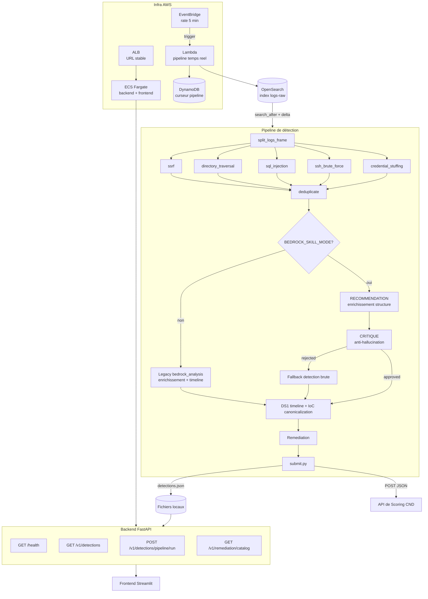

# Architecture

Région AWS : **eu-west-3** (Paris).

## Diagramme de flux

## Services AWS utilisés

| Service | Rôle | Configuration |
|---|---|---|
| **OpenSearch** | Index `logs-raw`, ingestion continue (~50-100 logs / 5 min) | FGAC Basic auth, `search_after` paginé |
| **Bedrock** | Claude Opus 4.6 (`eu.anthropic.claude-opus-4-6-v1`) — enrichissement + timeline raffinée | `converse()`, 6144 tokens max, throttle 0.75s |
| **ALB** | Load balancer stable (DNS fixe) devant ECS | Port 80 (frontend), port 8080 (API) |
| **ECS Fargate** | Backend FastAPI + Frontend Streamlit | 1 service, 2 conteneurs, derrière ALB |
| **Lambda** | Pipeline temps réel (poll OpenSearch → détection → soumission) | SAM, timeout 300s |
| **EventBridge** | Déclenchement périodique de la Lambda | `rate(5 minutes)` |
| **DynamoDB** | Curseur `search_after` persistant pour Lambda | Clé `PIPELINE_CURSOR` |
| **S3** | Stockage modèles et artefacts | Bucket projet |
| **ECR** | Images Docker backend/frontend | 2 repositories |

## Flux de données

1. **Ingestion** : OpenSearch reçoit des logs bruts (33 colonnes) toutes les 5 minutes
2. **Poll** : La pipeline lit les nouveaux logs via `search_after` avec un curseur persistant (fichier local ou DynamoDB)
3. **Détection** : `split_logs_frame()` répartit par `log_source` (auth/app/net/sys), puis 5 détecteurs heuristiques analysent les sous-ensembles
4. **Déduplication** : Stratégie `keep_most_specific` — élimine les détections redondantes par IP/fenêtre temporelle
5. **Enrichissement** : Mode Skill (RECOMMENDATION + CRITIQUE anti-hallucination) par défaut, ou enrichissement legacy via `converse()` fusionné
6. **Canonicalization DS1** : Timeline et IoC normalisés sur les fenêtres officielles du brief
7. **Remédiation** : Plans d'action attachés à chaque détection
8. **Soumission** : POST JSON vers l'API de scoring avec déduplication par fingerprint (cache fichier)

## Sécurité

- **Guardrails** : `guardrails.py` maintient des dictionnaires `ALLOWED_AWS_ACTIONS` et `BLOCKED_ACTIONS` pour limiter les appels AWS
- **Auth OpenSearch** : FGAC Basic (user `etudiant`), credentials dans `.env`
- **Bedrock** : IAM via SSO, profil `eu-west-3`
- **CORS** : Backend restreint au domaine ALB + origines configurables via `CORS_ORIGINS`
- **Anti-hallucination** : Mode CRITIQUE du skill rejette les enrichissements non ancrés dans les logs (fallback sur détection brute)
